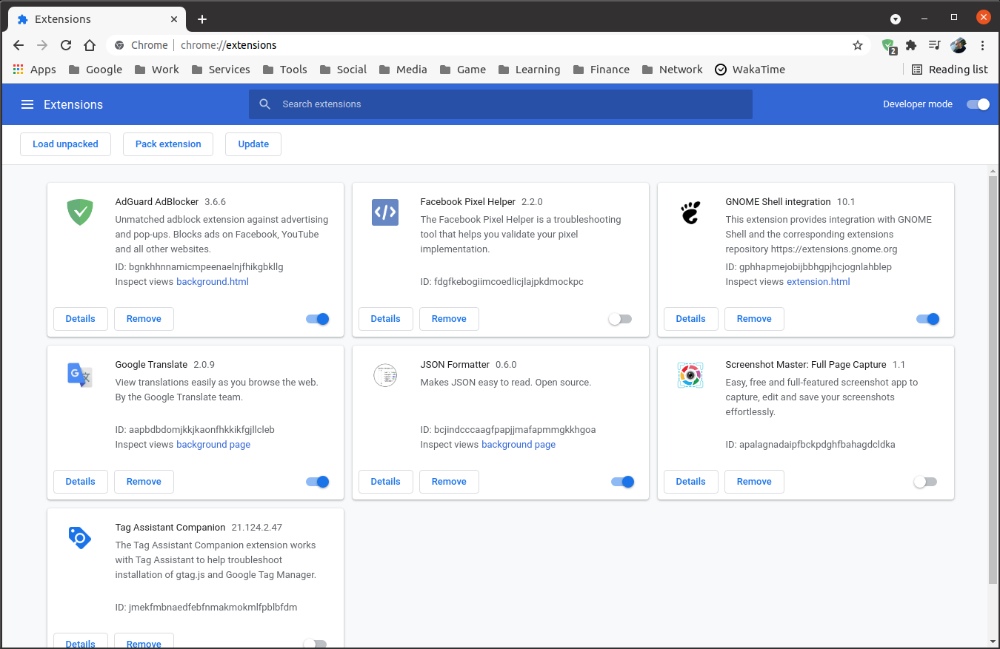

# Google Chrome Apps

Google Chrome app shortcuts to run web services in dedicated window.

## How to install

Enter extension management.

In extension management, enable developer mode in the upper right corner of the screen.

Click the "load unpacked" button and select the "app" folder inside the application folder you want to install.

The installed app icon will appear on the Google Chrome apps page.

## Note

You can find more info about apps on repo folders.

Report any bug or suggest changes using git [issues](https://github.com/fabianocouto/google-chrome-apps/issues).